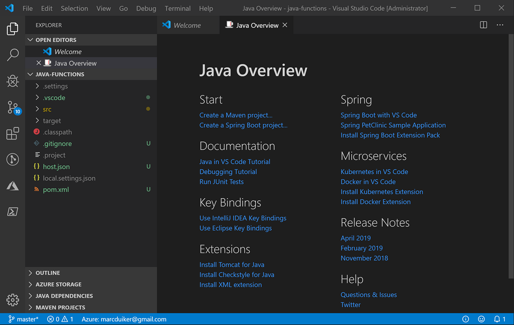

# Creating your first Azure Function

## Goal

The goal of this lab is to create a Function App in VS Code, run the application and trigger the default HTTP function.

## Steps

### 1. Creating a new Function Project

In VS Code, use the Command Palette (CTRL+Shift+P) and type/select

`Azure Functions: Create New Project`

- Select a folder where the function project will be created.
- Select `Java` as the language for the function project.
- Provide a group id for the project.
- Provide an artifact id for the project.
- Provide a version for the project (you can use the default `1.0-SNAPSHOT`).
- Provide a package name.
- Provide an app name.
- Choose `Open project in current window`

Now the function project will be scaffolded and you should see the following:



### 2. Inspect the Function class

Navigate to the `Function.java` file and inspect content of the Function class.

> What is the name of the function?

> How can the function be triggered?

### 3. Run the Function App Locally

Start to run & debug the Function App (`F5`).

The terminal window should show the output of Maven which is building and packaging the Function App.

Eventually the following line should appear:

`HttpTrigger-Java: [GET,POST] http://localhost:7071/api/HttpTrigger-Java`

### 4. Trigger the function

Use curl, Postman or the VS Code REST client to trigger the function by calling the local endpoint with either a GET or a POST:

```http
GET http://localhost:7071/api/HttpTrigger-Java?name=YOUR_NAME
```

```http
POST http://localhost:7071/api/HttpTrigger-Java
Content-Type: application/json

"YOUR_NAME"
```

> Does Function App respond with an Http Code 200 (OK) and a body?

> What is shown in the Terminal window?

Stop/disconnect the running application.

Let's move on to [Lab 2](lab2.md) and change this function to post an object to a queue.
